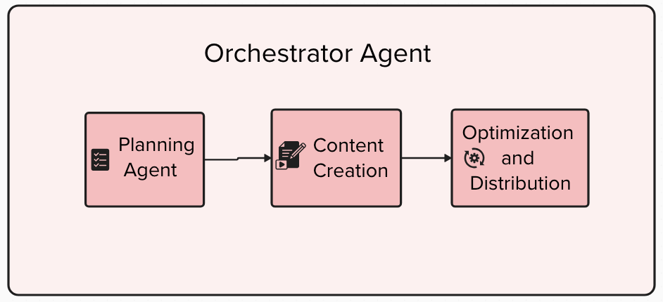

# social-media-agent
Social media agent using ADK, A2A and MCPs

Contains 3 simple agents

1) Planner
2) Creator
3) Optimizer

and an Orchestrator Agent.

Run the backend application

cd backend
uv sync
uv run main.py
app will run on port http://localhost:8000

To run the adk web
uv run adk web

Run the frontend
cd social-media-assistant-fe
yarn install
yarn run dev

FE will be accessible on http://localhost:5173

